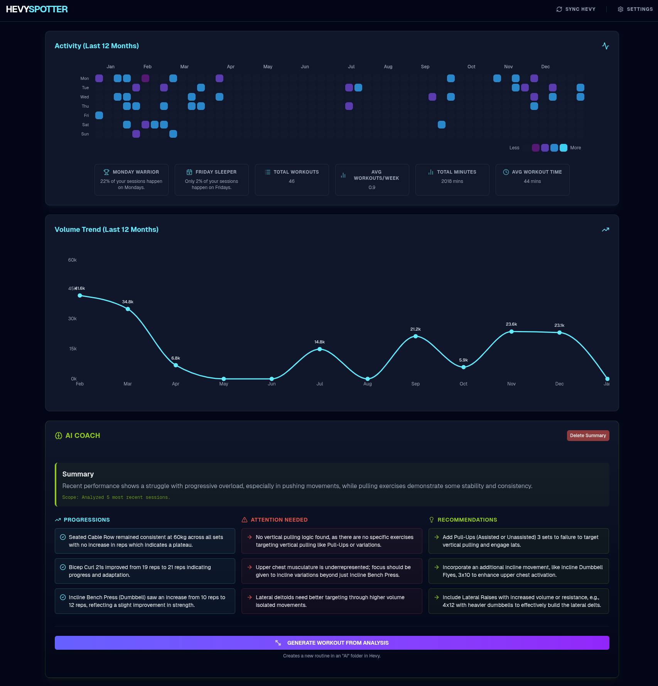

# HevySpotter

**Simple AI Analysis for Hevy**

> [!NOTE]
> This is a **vibe coded** project and is currently a **work in progress**.

[](https://vercel.com/new/clone?repository-url=https%3A%2F%2Fgithub.com%2Fklippel%2Fhevyspotter)

HevySpotter connects to your [Hevy](https://hevy.com/) account to analyze your recent workouts and generate new routines based on what you've likely neglected.



## Features

*   **AI Analysis:** Summarizes your recent training and spots trends.
*   **Workout Generator:** Creates a new routine for you to try based on your history.
*   **Basic Stats:** View your workout consistency and volume over time.
*   **Privacy:** Your API keys stay in your browser. No data is sent to our servers.

## Getting Started

1.  **Clone the repository**
    ```bash
    git clone https://github.com/yourusername/hevyspotter.git
    cd hevyspotter
    ```

2.  **Install dependencies**
    ```bash
    npm install
    ```

3.  **Run the application**
    ```bash
    npm run dev
    ```

4.  **Open in Browser**
    Navigate to `http://localhost:3000`.

## Setup

You will need two API keys:

1.  **Hevy API Key:** From your Hevy Settings (Pro required).
2.  **OpenAI API Key:** To generate the analysis and workouts.

Click **Settings** in the top right to enter them.

## Tech Stack

*   Next.js 15
*   Tailwind CSS
*   Recharts

## Roadmap / TODO

Since this is a vibe-coded project, here are some ideas for future improvements:

*   [ ] **1RM Tracking:** Visual charts for estimated One Rep Max on compound lifts (Bench, Squat, Deadlift).
*   [ ] **Social Sharing:** Generate clear, shareable images of workout stats.
*   [ ] **Exercise History:** Drill-down views for specific exercise progression over time.
